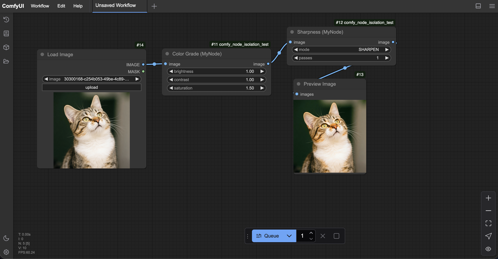

# ComfyUI Node Packer

ComfyUI loads every custom node in one Python process. When multiple nodes each run `pip install -r requirements.txt` into the shared environment, version conflicts are painful to debug.

This tool solves that by building a self-contained ComfyUI-loadable package folder: the node's Python source is compiled with Nuitka into a `.so`/`.pyd` extension, and all its pip dependencies are copied under a private `_vendor` tree — completely isolated from whatever the host has installed.

## How it works

`pack.py` takes any custom node directory and:

1. **Installs** `requirements.txt` into an isolated build folder via `pip --target`
2. **Auto-discovers** every top-level package that landed there (no manual mapping needed)
3. **Rewrites imports** in the node source using the Python AST — `from PIL import Image` becomes `from my_node._vendor.PIL import Image`
4. **Compiles** the rewritten source with Nuitka (`--module`)
5. **Assembles** `dist/<package_name>/` ready for `ComfyUI/custom_nodes/`

Heavy packages (`torch`, `numpy`, CUDA) are never vendored — those stay on the host.

## Output structure

```text
dist/<package_name>/
  __init__.py
  nodes.cpython-3xx-<platform>.so   # compiled node module
  _vendor/
    __init__.py
    PIL/           # vendored Pillow
    humanize/
    slugify/
    ...            # all transitive deps are vendored automatically
```

## Setup

```bash
git clone https://github.com/ashish-aesthisia/ComfyUI-Node-Packer
cd ComfyUI-Node-Packer
```

That's it. No venv, no `pip install` needed. On the first run `pack.py` detects that nuitka is missing, creates a `.tool_env/` venv next to itself, installs nuitka into it, and uses that Python for all subsequent steps. The `.tool_env/` is reused on every future run.

The node's own dependencies (`torch`, `numpy`, Pillow, etc.) are also installed automatically — into an isolated build folder, never into your system or any shared environment.

Platform extras (these can't be auto-installed):
- **Linux**: `apt install patchelf`
- **macOS**: `brew install ccache` *(optional, speeds up rebuilds)*
- **Windows**: Visual Studio Build Tools (required by Nuitka)

## Usage

```bash
# Pack any custom node directory
python pack.py <path/to/your_node>

# Examples
python pack.py my_node                              # example node bundled in this repo
python pack.py ~/ComfyUI/custom_nodes/my_cool_node # any node on disk

# Override the output package name (useful if the dir name is not a valid Python identifier)
python pack.py my_node --name my_cool_node_v2

# Choose a different output root
python pack.py my_node --output /tmp/dist

# Vendor deps but skip Nuitka (useful for testing the vendoring step alone)
python pack.py my_node --skip-compile
```

The packed folder lands in `dist/<package_name>/`. Copy it into ComfyUI:

```bash
cp -R dist/my_node  /path/to/ComfyUI/custom_nodes/
```

## Node requirements

Your custom node directory must contain:

| File | Purpose |
|------|---------|
| `requirements.txt` | pip packages to isolate |
| `nodes.py` | main module — compiled by Nuitka |
| `__init__.py` | ComfyUI registration (`NODE_CLASS_MAPPINGS` etc.) — copied as-is |

`__init__.py` typically just re-exports from `.nodes` and defines `NODE_CLASS_MAPPINGS`, so it works unchanged with the compiled extension.

If your main file isn't named `nodes.py`, the packer will use the only other `.py` file in the directory (if there is exactly one).

## Adding new dependencies

Just add the package to `requirements.txt` — no other configuration needed. The packer auto-discovers every package installed by pip, including transitive dependencies, and vendors all of them.

Previously, you would have had to maintain manual `IMPORT_NAME_OVERRIDES` and `IMPORT_REWRITES` dicts. Those are gone.

## What is not vendored

Keep these on the host — the packer skips them automatically:

```
torch  numpy  torchvision  torchaudio  comfyui  folder_paths
```

## Limits

- `ast.unparse()` is used for import rewriting, which normalises whitespace and strips comments from the staged source. The compiled output is unaffected; comments appear only in the intermediate file fed to Nuitka.
- The compiled extension is tied to your build machine's Python version, OS, and CPU architecture. Rebuild for each target runtime.
- Native wheels (e.g. Pillow) must be copied whole and validated against the target OS and Python version.

## Example node (`my_node/`)

`my_node/` is a minimal ComfyUI node bundled as a usage example. It exposes two nodes — **Color Grade** and **Sharpness** — that depend on Pillow, humanize, and python-slugify, all of which get vendored automatically.


